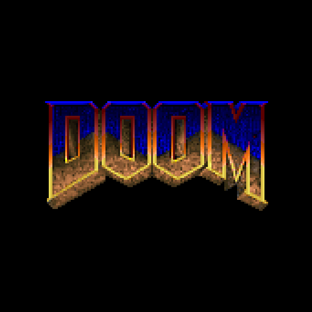
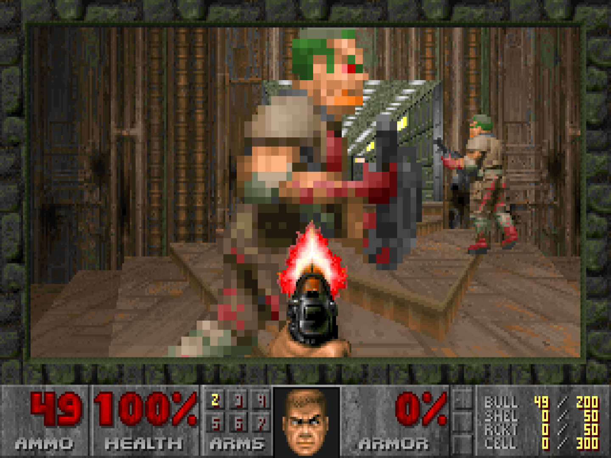
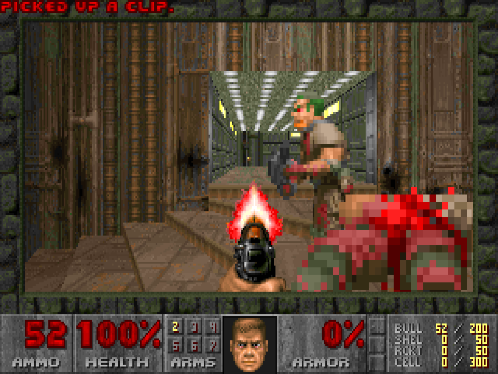
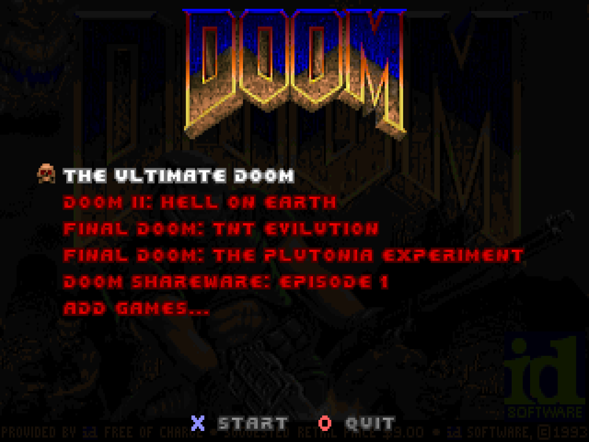
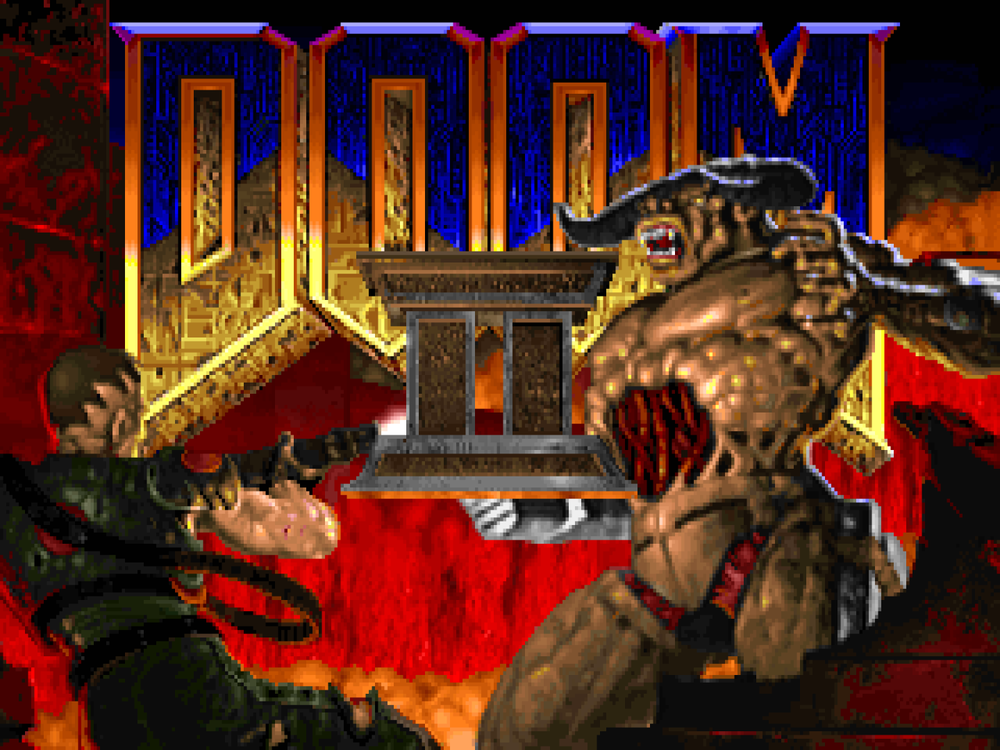
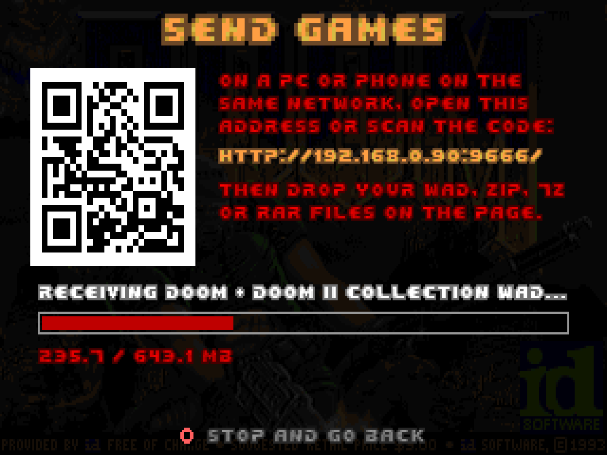
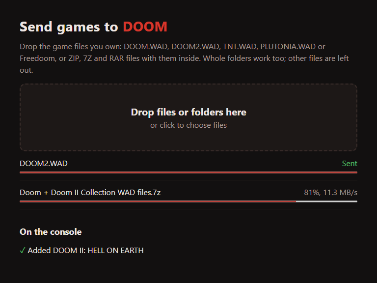

<p align="center"></p>

# DOOM for PS5 (native)

id Software's original DOOM source (`linuxdoom-1.10`) running as a native PS5 title: its own
home-screen icon, drawn on the GPU through Sony's AGC driver and VideoOut, DualSense input with
analog sticks and rumble, and the DOS-era FM music synthesised from the game's own instrument bank.
It ships with the free shareware episode of DOOM and plays The Ultimate DOOM, DOOM II and Final
DOOM from your own game files, which you can send from a PC or phone browser, download from a
link or copy to the console, including straight out of ZIP, 7Z and RAR archives.

<p align="center">
  
  
</p>
<p align="center">
  
  
</p>

## Requirements

A jailbroken PS5 with kstuff (fake-signed executables) and
[ShadowMountPlus](https://github.com/drakmor/ShadowMountPlus). Tested on firmware 13.00.

## Install

1. Download `PPSA99666.zip` from the [releases](../../releases) and check it against
   `PPSA99666.zip.sha256`.
2. Extract it and copy the `PPSA99666` folder to `/data/homebrew/` (FTP, ps5upload or USB).
3. ShadowMountPlus registers it within a few seconds and **DOOM** appears on the home screen.

## Games

DOOM opens on a game list. Out of the box it holds the shareware episode, *Knee-Deep in the Dead*;
every game you add appears there too, and the last one you played stays selected.

| File | Game |
| --- | --- |
| `DOOM.WAD`, `DOOMU.WAD` | DOOM, or The Ultimate DOOM when it has episode 4 |
| `DOOM2.WAD` | DOOM II: Hell on Earth |
| `TNT.WAD` | Final DOOM: TNT Evilution |
| `PLUTONIA.WAD` | Final DOOM: The Plutonia Experiment |
| `FREEDOOM1.WAD`, `FREEDOOM2.WAD` | [Freedoom](https://freedoom.github.io/) Phase 1 and 2 |

The files from the original releases and from the 2024 *DOOM + DOOM II* re-release both work.

### Adding your games

Whichever way, the game files can also be inside ZIP, 7Z or RAR archives: DOOM extracts the game
WADs it recognises and skips everything else.

- **Send them from a PC or phone.** In the game list choose *Add games...*, then *Send from PC or
  phone*. Open the address the screen shows (for example `http://192.168.1.50:9666/`) in a browser
  on the same network, or scan its QR code, and drop the files or whole folders on the page. Both
  the page and the console show what was added; archives are deleted once their games are out. The
  console only accepts files while that screen is open.
- **Copy them to the console.** Put the files or archives in `/data/homebrew/PPSA99666/wads/` (FTP,
  ps5upload or USB). DOOM picks them up the next time it starts.
- **Download them from a link.** In the game list choose *Add games...*, then *Link*, type an
  `http://` or `https://` address on the console keyboard and choose *Download*. The link can point
  at a WAD, an archive, or a folder; for a folder DOOM lists the files and you pick one or all.

<p align="center">
  
  
</p>

To download from your own PC instead, open a terminal in the folder that holds the files and run a
small web server, then use the address it prints with your PC's local IP (for example
`http://192.168.1.20:8000/`):

```bash
python -m http.server 8000
```

Any web server that lists a folder works (nginx, Apache, Caddy, IIS, `npx http-server`). One that
supports range requests (all of those except Python's) lets DOOM read a 7Z or ZIP without
downloading the parts it does not need; with Python's server it still works, just with more
traffic. Allow the port through the PC's firewall if the console cannot connect.

## Controls

| Input | In game | In menus |
| --- | --- | --- |
| Left stick | Move and strafe | Navigate |
| Right stick | Turn (speed follows Mouse Sensitivity) | |
| D-pad | Move and turn | Navigate |
| R2 | Fire | |
| Cross / Square | Use | Select, yes |
| Circle | Strafe modifier | Back, no |
| L1 / R1 | Previous / next weapon (automap zoom) | |
| L2 | Run | |
| Triangle / touchpad | Automap (Square: follow mode) | |
| Options | Menu | Close menu |

Prompts show the buttons to press, and *Read This!* in the main menu opens this list on the
console. Saves and settings stay on the console, and each game keeps its own saves. Holding **L1+R1** at launch uses the CPU scaler instead of
the GPU, should a firmware ever disagree with the GPU path.

## Building and internals

See [DEVELOPMENT.md](DEVELOPMENT.md) for the build, the architecture, the console test loop and the
PS5 behaviour learned along the way. Licenses and credits: [LICENSE](LICENSE) (GPL v2, id's
source) and [THIRD_PARTY_NOTICES.md](THIRD_PARTY_NOTICES.md).
