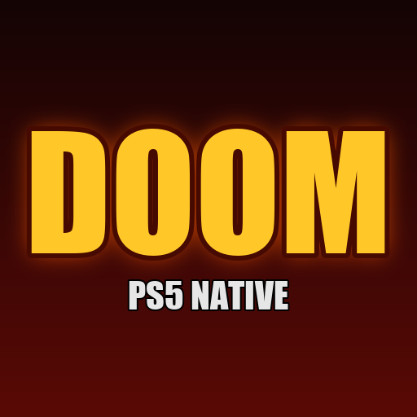

# DOOM for PS5 (native)

id Software's original DOOM source (`linuxdoom-1.10`) running as a native PS5 title: its own
home-screen icon, drawn on the GPU through Sony's AGC driver and VideoOut, DualSense input with
analog sticks and rumble, and the DOS-era FM music synthesised from the game's own instrument bank.
It ships with [Freedoom](https://freedoom.github.io/), a free full-length game, and plays id's
DOOM and DOOM II if you add your own WADs.

## Requirements

A jailbroken PS5 with kstuff (fake-signed executables) and
[ShadowMountPlus](https://github.com/drakmor/ShadowMountPlus). Tested on firmware 13.00.

## Install

1. Download `PPSA99666.zip` from the [releases](../../releases) and check it against
   `PPSA99666.zip.sha256`.
2. Extract it and copy the `PPSA99666` folder to `/data/homebrew/` (FTP, ps5upload or USB).
3. ShadowMountPlus registers it within a few seconds and **DOOM** appears on the home screen.

## Games

- Launch normally: Freedoom Phase 2 (DOOM II style, 32 maps).
- Hold **L2** while it starts: Freedoom Phase 1 (DOOM style, 4 episodes).
- Your own `DOOM.WAD`, `DOOM2.WAD`, `PLUTONIA.WAD` or `TNT.WAD` in `/data/homebrew/PPSA99666/wads/`
  take priority over Freedoom (DOOM II first; hold L2 for DOOM).

## Controls

| Input | In game | In menus |
| --- | --- | --- |
| Left stick | Move and strafe | Navigate |
| Right stick | Turn (speed follows Mouse Sensitivity) | |
| D-pad | Move and turn | Navigate |
| R2 | Fire | |
| Cross / Square | Use | Select, yes |
| Circle | Strafe modifier | Back, no |
| L1 / R1 | Previous / next weapon (automap zoom) | |
| L2 | Run | |
| Triangle / touchpad | Automap (Square: follow mode) | |
| Options | Menu | Close menu |

Saves and settings stay on the console. Holding **L1+R1** at launch uses the CPU scaler instead of
the GPU, should a firmware ever disagree with the GPU path.

## Building and internals

See [DEVELOPMENT.md](DEVELOPMENT.md) for the build, the architecture, the console test loop and the
PS5 behaviour learned along the way. Licenses and credits: [LICENSE](LICENSE) (GPL v2, id's
source) and [THIRD_PARTY_NOTICES.md](THIRD_PARTY_NOTICES.md).
